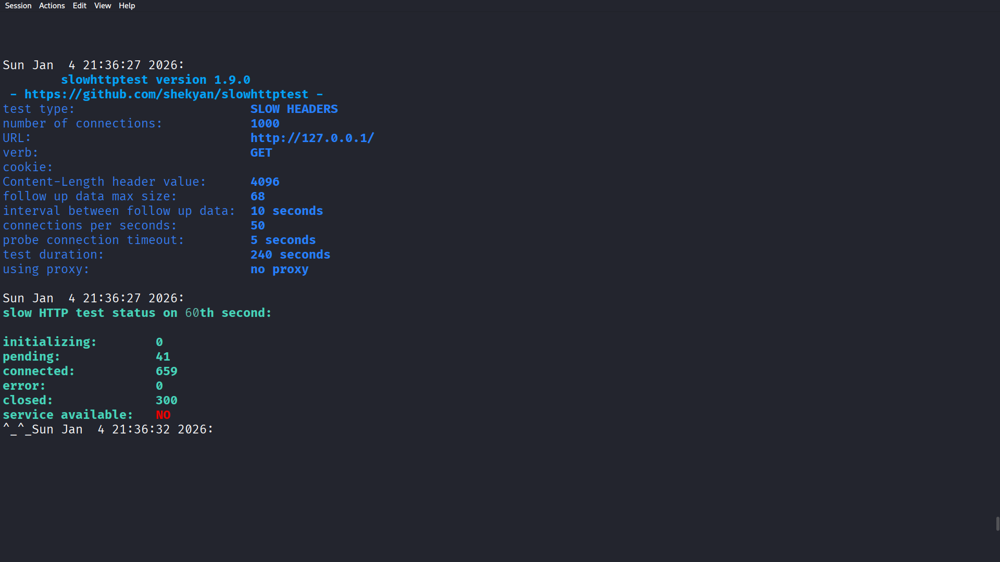

# Task 3: Conducting a DoS Attack

Performed **Slow HTTP Header DoS attack** using `slowhttptest` on localhost (`http://127.0.0.1`).

## Attack Details:
- Tool: `slowhttptest` (v1.9.0)
- Attack Type: Slow Headers
- Connections: 1000
- Duration: 60+ seconds

## Key Result:
- **Service Available: NO** → server became unresponsive
- Confirmed DoS impact on **availability**

> 🔒 Ethical Note: All testing done on localhost. No external systems targeted.

